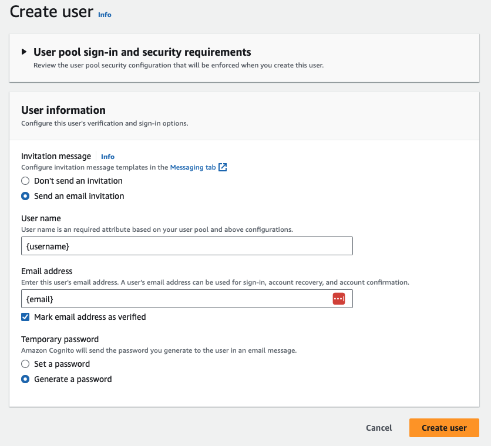

# HelioCloud User Onboarding Guide
HelioCloud makes use of AWS Cognito UserPools for governing access to the portal and daskhub. Below are listed the steps in order to setup user accounts.

## Prerequisites
Before creating a user, the following is required:
- Username
- Email
- UserPool ID

## User Creation
### AWS Console
The following makes use of the AWS console in the browser.
1. Navigate to the AWS Cognito menu and select User Pool associated with your HelioCloud instance
2. Under `Users`, select `Create user`
3. Ensure the following settings are selected:
    * Send an invitation
    * Mark email address as verified
    * Generate a password
4. Ensure that the provided username and email are entered


### AWS CLI
The following makes use of the AWS CLI.

This method requires specifying the deployed region of this HelioCloud instance.
```
aws cognito-idp admin-create-user \
    --user-pool-id {user-pool-id} \
    --username {username} \
    --desired-delivery-mediums EMAIL \
    --user-attributes Name=email,Value={email}\
    --region {deployed-region}
```

## User Login
Once a user is created, ensure that the user receives an email containing their temporary password.

*If a user does not receive a temporary password via email, repeat the above instructions but set a password manually. The CLI requires an added `--temporary-password` argument.*

With the temporary password, a user may login to either the portal or daskhub and will be prompted to set a new password.
